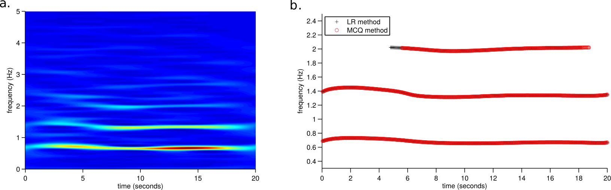

# Extract time-frequency tracks from a time–frequency distribution


Matlab code to extract time–frequency tracks, which represent instantaneous frequency
(IF) laws, from time–frequency distributions (TFDs).  Two methods presented, based on the
work of Rankine et al. (2007) and McAulay–Quatieri (1986); details in [references](#references).

# requirements: 

Matlab (R2013 or newer,
[Mathworks website](http://www.mathworks.co.uk/products/matlab/)). Also works in
[Octave](https://www.gnu.org/software/octave/) (version 4 or newer) but slow in
comparison to Matlab.


# use 
Example comparing both methods (code in <example\_IFest.m> but requires
[TFD toolbox](http://otoolej.github.io/code/memeff_TFDs/) from reference [4](#references)):
```matlab
%---------------------------------------------------------------------
% load test signal
%---------------------------------------------------------------------
b=load('testsignal_10dB.mat');
N=length(b.x); Ntime=512; 
x=b.x; Fs=b.Fs;

%---------------------------------------------------------------------
% generate TFD:
% (requires TFD code from http://otoolej.github.io/code/memeff_TFDs/)
%---------------------------------------------------------------------
tf=gen_TFD_EEG(x,Fs,Ntime,'sep');


% parameters for IF methods:
DELTA_SEARCH_FREQ=2;  % in Hz/s 
MIN_IF_LENGTH=6;      % in seconds


t_scale=(length(x)/b.Fs/Ntime);  f_scale=(1/size(tf,2))*(Fs/2);
delta_freq_samples=floor( (DELTA_SEARCH_FREQ/f_scale)*t_scale );
min_track_length=floor( MIN_IF_LENGTH/t_scale );


%---------------------------------------------------------------------
% Rankine et al. (2007) method:
%---------------------------------------------------------------------
lower_prctile_limit=98; 
it=tracks_LRmethod(tf,Fs,delta_freq_samples,min_track_length,lower_prctile_limit);

% plot:
figure(1); clf; hold all; 
for n=1:length(it)
    hlr=plot(it{n}(:,1).*t_scale,it{n}(:,2).*f_scale,'k+'); 
end


%---------------------------------------------------------------------
% McAulay and Quatieri (1986) method:
%---------------------------------------------------------------------
max_peaks=3;
it2=tracks_MCQmethod(tf,Fs,delta_freq_samples,min_track_length,max_peaks);

% plot:
for n=1:length(it2)
    hmcq=plot(it2{n}(:,1).*t_scale,it2{n}(:,2).*f_scale,'ro'); 
end
xlabel('time (seconds)'); ylabel('frequency (Hz)');
xlim([0 N/Fs]);
legend([hlr hmcq],{'LR method','MCQ method'});
```


*Example: a.: time–frequency (TF) distribution of signal; b.: TF tracks using the Rankine et al. (2007) method (LR) and McAulay–Quatieri (1986) method (MCQ)*


# test computer setup
- hardware:  Intel(R) Xeon(R) CPU E5-1603 0 @ 2.80GHz; 8GB memory.
- operating system: Ubuntu GNU/Linux x86_64 distribution (Wily Werewolf, 15.10), with Linux
  kernel 4.2.0-35-generic 
- software: Matlab (R2013a) and Octave (version 4.0.0)

---

# licence

```
Copyright (c) 2016, John M. O' Toole, University College Cork
Copyright (c) 2012, John M. O' Toole, University of Deusto
Copyright (c) 2011, Nathan J. Stevenson, University College Cork
Copyright (c) 2008, Nathan J. Stevenson, University of Queensland

All rights reserved.

Redistribution and use in source and binary forms, with or without modification,
are permitted provided that the following conditions are met:

  Redistributions of source code must retain the above copyright notice, this
  list of conditions and the following disclaimer.

  Redistributions in binary form must reproduce the above copyright notice, this
  list of conditions and the following disclaimer in the documentation and/or
  other materials provided with the distribution.

  Neither the name of the University College Cork nor the names of its
  contributors may be used to endorse or promote products derived from
  this software without specific prior written permission.

THIS SOFTWARE IS PROVIDED BY THE COPYRIGHT HOLDERS AND CONTRIBUTORS "AS IS" AND
ANY EXPRESS OR IMPLIED WARRANTIES, INCLUDING, BUT NOT LIMITED TO, THE IMPLIED
WARRANTIES OF MERCHANTABILITY AND FITNESS FOR A PARTICULAR PURPOSE ARE
DISCLAIMED. IN NO EVENT SHALL THE COPYRIGHT HOLDER OR CONTRIBUTORS BE LIABLE FOR
ANY DIRECT, INDIRECT, INCIDENTAL, SPECIAL, EXEMPLARY, OR CONSEQUENTIAL DAMAGES
(INCLUDING, BUT NOT LIMITED TO, PROCUREMENT OF SUBSTITUTE GOODS OR SERVICES;
LOSS OF USE, DATA, OR PROFITS; OR BUSINESS INTERRUPTION) HOWEVER CAUSED AND ON
ANY THEORY OF LIABILITY, WHETHER IN CONTRACT, STRICT LIABILITY, OR TORT
(INCLUDING NEGLIGENCE OR OTHERWISE) ARISING IN ANY WAY OUT OF THE USE OF THIS
SOFTWARE, EVEN IF ADVISED OF THE POSSIBILITY OF SUCH DAMAGE.
```


# references

1. L Rankine, M Mostefa, B Boualem. "IF estimation for multicomponent signals using image
   processing techniques in the time–frequency domain." Signal Processing 87(6) (2007):
   1234-1250.

2. RJ McAulay, TF Quatieri. Speech analysis/synthesis based on a sinusoidal
   representation. IEEE Transactions on Acoustics, Speech, and Signal Processing, 34(4),
   (1986), 744–754.

3. NJ Stevenson, JM O'Toole, LJ Rankine, GB Boylan, B Boashash. "A nonparametric feature
   for neonatal EEG seizure detection based on a representation of pseudo-periodicity."
   Medical Engineering & Physics 34.4 (2012): 437-446.

4. JM O’ Toole, B Boashash. "Time–frequency detection of slowly varying periodic signals
   with harmonics: methods and performance evaluation." EURASIP Journal on Advances in
   Signal Processing, 2011(193797)
   
5. JM O' Toole and B Boashash, “Memory Efficient Algorithms for Quadratic TFDs”,
   Chapter 6.6; in Time–Frequency Signal Analysis and Processing, Second Edition, Academic
   Press, pp. 374–385, 2016 (ISBN: 9780123984999).


---

# contact

John M. O' Toole

Neonatal Brain Research Group,  
Irish Centre for Fetal and Neonatal Translational Research ([INFANT](http://www.infantcentre.ie/)),  
Department of Paediatrics and Child Health,  
University College Cork,  
Western Gateway Building, Room 2.17,  
Cork, Ireland

- email: j.otoole AT ieee.org
- web: http://otoolej.github.io/
